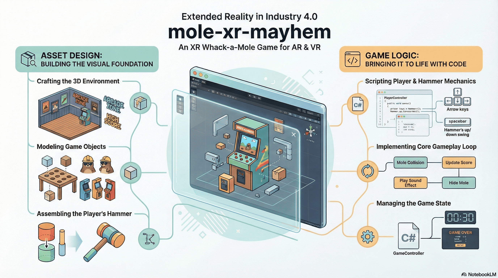
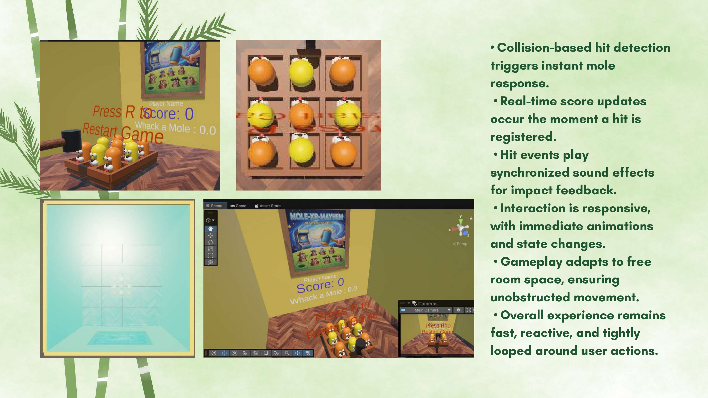
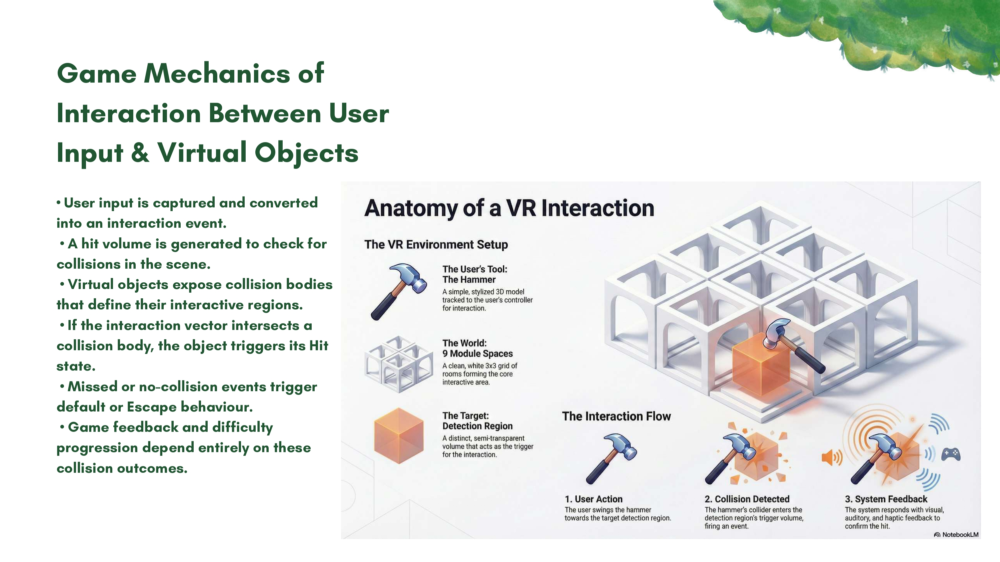

# mole-xr-mayhem
An XR Whack-a-Mole Game for AR & VR in Unity
> Extended Reality in Industry 4.0



## Table of Contents
- [mole-xr-mayhem](#mole-xr-mayhem)
  - [Table of Contents](#table-of-contents)
  - [1.0 Project Overview](#10-project-overview)
    - [1.1 High-Level Summary](#11-high-level-summary)
  - [1.2 Project Structure](#12-project-structure)
  - [2.0 Asset and Environment Design](#20-asset-and-environment-design)
    - [2.1 World Building: The Arcade Room](#21-world-building-the-arcade-room)
    - [2.2 Gameplay Arena: The Whack-A-Mole Table](#22-gameplay-arena-the-whack-a-mole-table)
    - [2.3 Interactive Elements: The Mole Prefab](#23-interactive-elements-the-mole-prefab)
    - [2.4 Decorative Elements: The Arcade Machine Prefab](#24-decorative-elements-the-arcade-machine-prefab)
  - [3.0 Core Gameplay Scripting and Mechanics](#30-core-gameplay-scripting-and-mechanics)
    - [3.1 Game State Management: The Game Controller and Timer (GameController.cs)](#31-game-state-management-the-game-controller-and-timer-gamecontrollercs)
    - [3.2 Player Input: The Player Controller Script (PlayerController.cs)](#32-player-input-the-player-controller-script-playercontrollercs)
    - [3.3 Primary Interaction: The Hammer Swing Mechanic (Hammer.cs)](#33-primary-interaction-the-hammer-swing-mechanic-hammercs)
  - [4.0 Interaction, Scoring, and Game Loop](#40-interaction-scoring-and-game-loop)
    - [4.1 Collision Detection and Response](#41-collision-detection-and-response)
    - [4.2 Scoring and UI Feedback](#42-scoring-and-ui-feedback)
    - [4.3 Audio Integration](#43-audio-integration)
    - [4.4 Game Over and Restart Logic](#44-game-over-and-restart-logic)
  - [5.0 Conclusion](#50-conclusion)

## 1.0 Project Overview



### 1.1 High-Level Summary

A clear project overview is strategically important for establishing the goals and scope of any game development effort. It provides a foundational understanding of the final product, guiding the detailed technical work required to achieve it. This report deconstructs a 3D Whack-A-Mole game designed to be played on a standard computer screen or in a VR environment.

The final user experience places the player inside a virtual arcade room, in front of a Whack-A-Mole table populated by nine moles. The player controls a floating hammer using the keyboard's arrow keys to navigate left, right, forward, and backward. Pressing the Spacebar key triggers the primary game action: swinging the hammer down. If the hammer collides with a raised mole, the hit is registered, the mole disappears, a sound effect plays, and the player's score is incremented on a large display. A 30-second timer continuously counts down, defining the length of a play session. When the timer reaches zero, the game ends, a "Game Over" message is displayed, and the player is prompted to press the Spacebar again to restart the game. This cycle of play, scoring, and restarting forms the complete gameplay loop. This complete gameplay loop is realized through an immersive arcade environment, built upon a foundation of carefully designed 3D assets.

## 1.2 Project Structure 
```bash
mole-xr-mayhem/
├── Assets/
│   ├── InputSystem_Actions.inputactions  # Custom XR/Keyboard input mappings
│   ├── Materials/                        # Visual styling (Mole skins, environment)
│   ├── Prefabs/
│   │   └── Mole.prefab                   # Reusable Mole object with scripts/colliders
│   ├── Scenes/
│   │   └── SampleScene.unity             # Primary gameplay level
│   ├── Scripts/                          # CORE LOGIC
│   │   ├── GameController.cs             # Score, timer, and game state management
│   │   ├── Hammer.cs                     # Physics interaction & hit detection
│   │   ├── Mole.cs                       # Individual mole behavior (Up/Down/Hit)
│   │   └── PlayerController.cs           # Interaction handling (XR/Input)
│   ├── Settings/                         # URP (Universal Render Pipeline) configs
│   ├── sounds/                           # Audio clips (whack, background, mole-up)
│   └── TextMesh Pro/                     # UI framework and font assets
├── Packages/                             # Unity Package Manager dependencies
├── ProjectSettings/                      # Engine-level configurations (Physics, XR, Layers)
└── UserSettings/                         # Local editor preferences
```

## 2.0 Asset and Environment Design



### 2.1 World Building: The Arcade Room

A well-designed environment is crucial for establishing a game's theme and providing context for the gameplay. In this project, a virtual arcade room serves as the immersive setting, housing the Whack-A-Mole table and reinforcing the game's retro aesthetic. The entire room is constructed from a collection of primitive Unity objects, textured and arranged to create a cohesive scene.

The construction of the room includes the following components:

* Building Shell: A large Cube primitive is scaled to form the walls and ceiling of the room. To ensure the interior walls are visible, the cube's material shader is set to Particles > Standard Surface and configured to be "two sided."
* Floor: A Plane object is scaled to fit the dimensions of the room's shell. A downloaded "wood floor texture" is applied to a new material, which is then assigned to the plane to create a realistic floor surface.
* Wall Decor: Additional Plane objects are used to simulate posters on the walls. Textures featuring classic arcade games like Pac-Man, X-Men, and Donkey Kong are applied to these planes to enhance the arcade theme.
* Text Elements: 3D Text objects are used for all in-game signage. This includes large thematic text like "ARCADE," as well as functional UI elements for displaying the "SCORE" and the game timer. Properties such as font size and color are adjusted in the Unity Inspector to achieve the desired visual style.

This combination of elements creates a complete environmental context for the central gameplay arena: the Whack-A-Mole table.

### 2.2 Gameplay Arena: The Whack-A-Mole Table

The technical goal of the Whack-A-Mole table is to create a structured, grid-like arena where the moles can appear in predictable locations. The table is constructed as a composite GameObject made from several standard Cube primitives.

The base of the table is a large, flattened cube that serves as its floor. Four additional cubes are scaled into long, thin shapes and positioned to form the outer walls. To create the nine distinct holes for the moles, four more cubes are arranged in an intersecting grid (described as a "tic-tac-toe" pattern) inside the walls. To provide clear visual contrast and definition, two distinct materials—a "table dark" and a "table light"—are created and applied to different parts of the table structure. This simple but effective design provides the physical stage for the game's dynamic characters: the moles.

### 2.3 Interactive Elements: The Mole Prefab

In Unity, creating game characters and objects as reusable Prefabs is a fundamental best practice that ensures efficiency and consistency. The mole character is first assembled as a single GameObject and then saved as a prefab, allowing it to be easily duplicated throughout the scene.

The assembly of a single Mole GameObject involves several primitive shapes parented together:

* Body: A Capsule primitive, scaled to an appropriate size.
* Eyes & Pupils: Sphere primitives are scaled down, duplicated, and positioned on the body to form the eyes and smaller pupils.
* Nose/Mouth: The nose and mouth area is constructed from multiple Sphere primitives of varying sizes.
* Tongue: A Capsule primitive is flattened and rotated to protrude from the mouth, forming a tongue.

Once this hierarchy of objects is assembled and parented to a root "Mole" GameObject, the entire structure is dragged from the scene hierarchy into the project's asset folder. This action creates the Prefab. This single prefab is then duplicated multiple times to populate the nine slots on the table. To create visual variety among the identical models, several different colored materials are created and applied to the various mole instances in the scene. The next step in populating the environment involves creating decorative assets like arcade machines.

### 2.4 Decorative Elements: The Arcade Machine Prefab

To complete the arcade atmosphere, decorative arcade machine assets serve as environmental "set dressing." These non-interactive objects enhance the theme and fill the virtual space, making the room feel more authentic. Like the mole, the arcade machine is built from primitives and saved as a reusable Prefab.

The construction of the arcade machine Prefab uses the following components:

* Cabinet: The main body of the machine is assembled from several scaled Cube objects to form the base, monitor housing, and marquee.
* Screen/Posters: Plane objects are used for the screen and side art, with textures of classic game art applied to their materials.
* Joystick: A functional-looking joystick is created by combining a Sphere for the handle and a Cylinder for the stick.
* Buttons: Sphere primitives are flattened into a disc shape to serve as the arcade buttons.

This composite object is also saved as a Prefab. It is then duplicated and placed around the room. To add variety, each instance can be customized with different cabinet colors and poster art. With the static design of the game's assets and environment complete, the focus shifts to the dynamic C# scripting that brings them to life.

## 3.0 Core Gameplay Scripting and Mechanics

### 3.1 Game State Management: The Game Controller and Timer (GameController.cs)

A "Game Controller" script serves a strategic role as a central manager for the game's overall state. It is not attached to a visible character or object but rather to an empty GameObject in the scene. This allows it to operate as an authoritative manager, handling high-level logic like tracking time and managing the core game loop.

The technical implementation of the game timer follows a clear structure:

* Setup: An empty GameObject is created in the scene and named "Game Controller." The GameController.cs script is created and attached to this object.
* Key Variables: The script declares two main variables to manage the timer. A public TextMesh timerText variable creates a slot in the Unity Inspector to link to the 3D Text object that displays the time. A public float gameTimer is initialized with a value of 30, representing the 30-second game duration.
* Core Logic: The script's Update() method, which runs once per frame, is used to decrement gameTimer by a small amount each frame using Time.deltaTime. This ensures the countdown is based on real-world seconds, not the computer's frame rate.
* Conditional Display: An if/else block checks if the gameTimer is still greater than zero.
  * If true, the on-screen text is updated with the current time. The Mathf.Floor function is used to round the float value down to the nearest whole number, preventing distracting milliseconds from being displayed.
  * If false, the game is over, and the on-screen text is set to the static string "Game Over."

With the overall game state managed, the next step is to implement the specific mechanics of player control.

### 3.2 Player Input: The Player Controller Script (PlayerController.cs)

The technical goal of the PlayerController.cs script is to translate keyboard input from the arrow keys into the physical movement of the player's hammer in the 3D space. The script is attached to a dedicated controller object that serves as the parent for the hammer model.

The setup involves creating an empty GameObject named "Player Controller" and attaching the PlayerController.cs script to it. The hammer GameObject is then made a child of this controller, ensuring any movement applied to the parent also moves the hammer. The Hammer.cs script, which controls the swing action, is attached to the child Hammer object itself.

The C# code's logic is implemented as follows:

* Input Capture: Within the Update() method, the script captures player input on both axes using Input.GetAxis("Horizontal") and Input.GetAxis("Vertical"). These functions return a value between -1 and 1 based on which arrow keys (or WASD keys) are being pressed.
* Movement Execution: The captured input values are then used to move the GameObject via the transform.Translate() method, which applies movement relative to the object's current position.
* Z-Axis Anomaly: A notable implementation detail in this project is the backward orientation of the scene's Z-axis (the "forward" direction). This anomaly required a code adjustment to ensure the controls felt intuitive. Instead of using Vector3.right and Vector3.forward for movement, the code uses their opposites: -Vector3.right and -Vector3.forward. This adjustment reverses the input, so pressing the "up" arrow key correctly moves the hammer forward in the scene. This serves as a key insight into practical debugging during development.

With the player's movement controller established, the focus turns to the primary action the player can perform: swinging the hammer.

### 3.3 Primary Interaction: The Hammer Swing Mechanic (Hammer.cs)

The Hammer.cs script is responsible for managing the state and animation of the hammer swing, which is the player's primary method of interacting with the game world. It translates a single keypress into a rotational animation, providing immediate and satisfying feedback to the player.

The core logic of the hammer swing is built on several key principles:

* Rotation Principle: The swing is not a complex animation but a simple rotation on the X-axis. The script toggles the hammer's rotation between an "up angle" (90 degrees) and a "down angle" (0 degrees).
* State Tracking and Target Rotations: A private bool hammerIsUp variable tracks the hammer's current state. To manage the target rotations, two private Quaternion variables are used, as Quaternion is Unity's required data type for rotation. These are initialized in the Start() method using Quaternion.Euler() to convert the intuitive degree values into the necessary Quaternion format.
* Reusable SwingHammer() Function: Rather than placing all logic directly in Update(), a dedicated SwingHammer(bool hammerUp, Quaternion hammerRotation) function is created. This is a software engineering best practice that improves code clarity and reduces repetition. The function takes the new state and target rotation as parameters, updates the hammerIsUp variable, and applies the rotation to the hammer's transform.
* Input Trigger: In the Update() method, Input.GetKeyDown(KeyCode.Space) detects the player's action. An if/else block checks the hammerIsUp state and calls the SwingHammer() function with the appropriate parameters to move the hammer to its opposite position (e.g., if up, call SwingHammer with parameters for the down state).
* Automated Return: To improve game feel, the hammer automatically returns to its up position after a short delay. When the hammer is not up, a timer (hammerDownMaxTime, initialized to 0.25f) is decremented by Time.deltaTime. When this timer reaches zero, the SwingHammer() function is called to return the hammer to its up position. The function also resets the timer by setting hammerDownMaxTime = 0.25f, ensuring a consistent delay for every swing.

With the hammer's movement and swing mechanics coded, the next logical step is to define how the hammer's swing interacts with other game objects, specifically the moles.

## 4.0 Interaction, Scoring, and Game Loop

### 4.1 Collision Detection and Response

Collision detection is a strategically vital mechanism in game development, as it bridges the gap between a player's action and a tangible game outcome. For this project, it is the system that connects the hammer swing to the event of hitting a mole. This requires configuring specific physics components in Unity and implementing C# logic to respond to collision events.

Collision Component Setup

GameObject	Component Added	Configuration & Purpose
Hammer	Box Collider	The default Capsule Collider is first removed and replaced with a Box Collider to provide a more suitable shape for the hammer's head.
Hammer	Rigidbody	Enables the GameObject to be detected by Unity's physics engine. It is required for the OnCollisionEnter function to be called on scripts attached to this object or its colliders. Configured with Use Gravity disabled and all Constraints frozen to prevent unwanted movement.
Mole	Tag	A custom tag named "Mole" is created and applied to the mole prefab, allowing for easy identification in code.

The C# implementation resides in the Hammer.cs script, using Unity's built-in OnCollisionEnter(Collision collision) function. This function is automatically called whenever the hammer's collider touches another collider. Inside this function, a simple if statement checks the tag of the object it collided with: if (collision.gameObject.tag == "Mole"). If this condition is true, the game knows a successful hit has occurred. Once a collision with a mole is confirmed, the game must provide immediate feedback to the player in the form of scoring updates and audio cues.

### 4.2 Scoring and UI Feedback

The scoring system's goal is to track the player's performance and display it in real-time on the in-game UI. This provides a direct measure of success and is a core component of the game's feedback loop. The logic for this is handled within the Hammer.cs script, as the hammer is the agent responsible for scoring points.

The implementation involves the following steps:

* Variable Setup (Hammer.cs): A private int score variable is declared to hold the player's score. To link the script to the on-screen text display, a [SerializeField] private TextMesh scoreText variable is used. This approach maintains good encapsulation by keeping the variable private to other scripts while still allowing for convenient assignment in the Unity Inspector.
* Score Update Logic: A dedicated UpdateScore() method is created to handle all scoring actions. When called, it first increments the score using score++. It then updates the on-screen display by setting the scoreText.text property to a formatted string, such as "Score: " + score.
* Hiding the Mole: After a successful hit, the OnCollisionEnter function in Hammer.cs gets a reference to the Mole.cs script attached to the collided mole using collision.gameObject.GetComponent<Mole>(). It then immediately calls that script's public HideMole() method, causing the mole to disappear from view.

In addition to visual feedback, auditory feedback is critical for reinforcing player actions.

### 4.3 Audio Integration

Sound effects provide critical "game feel," reinforcing player actions with satisfying auditory feedback and adding to the environment's immersion. The project integrates three distinct audio elements, each handled by an AudioSource component.

* Background Music: An AudioSource component is added to the central "Game Controller" object. A background music audio clip is assigned to it, and the component's "Play on Awake" and "Loop" properties are enabled. This ensures the music starts automatically when the game begins and plays continuously.
* Mole Rise Sound: An AudioSource is added to the Mole prefab, but its "Play on Awake" property is disabled. The Mole.cs script gets a reference to this component in its Start() method. The sound is then played by calling .Play() from within the ShowMole() method, ensuring the sound effect is perfectly synchronized with the mole's appearance.
* Hammer Hit Sound: Similarly, an AudioSource is added to the Hammer object with "Play on Awake" disabled. The Hammer.cs script gets this component in Start() and calls .Play() from within the OnCollisionEnter function, but only after confirming that the collision was with a mole.

With all interaction systems in place, the final piece of the game loop is defining what happens when the timer runs out.

### 4.4 Game Over and Restart Logic

A clear game-over state and a seamless restart mechanism are essential for completing the gameplay loop and encouraging replayability. This logic is managed by the GameController.cs script, which already controls the game timer.

The implementation of the restart functionality includes several key elements:

* UI Element: A 3D Text object is created in the scene with the message "Press Spacebar to restart game." A reference to this text object is stored in a [SerializeField] variable within the GameController script.
* Hiding/Showing Text: To ensure the restart text is only visible when needed, it is hidden at the start of the game by calling gameObject.SetActive(false) in the script's Start() method. When the game timer reaches zero, the else block of the timer logic is executed, and the text is made visible by calling gameObject.SetActive(true).
* Restart Trigger: Within that same else block (meaning it can only run when the game is already over), the script checks for player input using Input.GetKeyDown(KeyCode.Space).
* Scene Reloading: When the spacebar is pressed in the game-over state, a RestartGame() function is called. This function uses the SceneManager class to reload the current level: SceneManager.LoadScene(SceneManager.GetActiveScene().name). This effectively resets all game objects and scripts to their initial state, starting the game over. To use this functionality, the script must include the using UnityEngine.SceneManagement; directive at the top.


---


## 5.0 Conclusion

This report has deconstructed the key development stages of a complete Whack-A-Mole game in Unity. The process began with foundational asset design, where primitive shapes were composed into prefabs for the environment, table, moles, and decorative arcade machines. It then moved to core gameplay scripting, detailing the implementation of a central game controller for timer management, a player controller for movement, and a hammer script for the primary swing mechanic. Finally, it covered the interaction systems for collision detection, scoring, and audio feedback, as well as the game state management that handles the game over and restart loop. These components combine to create a polished, playable, and replayable game experience.

Contributors
- https://github.com/kintsugi-programmer
- https://github.com/BhatiRishabh
- https://github.com/gurvender02
